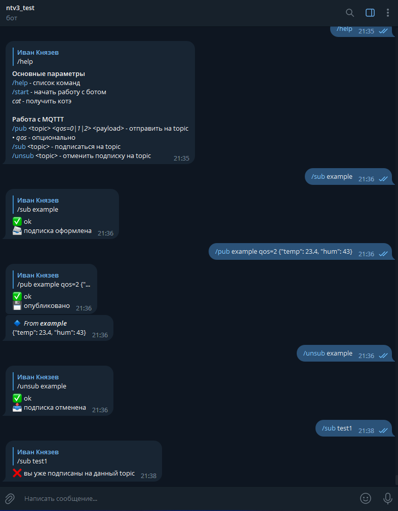

# Telegram MQTT Bot

## Usage example



## Env

Put env vars to `.env`

Example in `.env.example`


## Local deployment:

* With database in Docker

1. Go to `database_deployment` directory

```bash
cd database_deployment
```

2. Create a containers and start them or use instruction in `database_deployment` directory in Linux

```bash
docker compose up -d
```

- Run to stop and delete the containers

    ```bash
    docker compose down
    ```

3. Go back to the original directory

```bash
cd ..
```

4. Start the bot

```bash
python -m app
```


## Docker deployment

1. Follow steps 1-3 from _Local deployment_

2. Build docker bot image:

```bash
docker build . -t nto-mqtt-bot
```
- Or clone from GitHub Packages 

3. Create a container and start his

```bash
docker compose up -d
```

- Run to stop and delete the bot container

    ```bash
    docker compose down
    ```